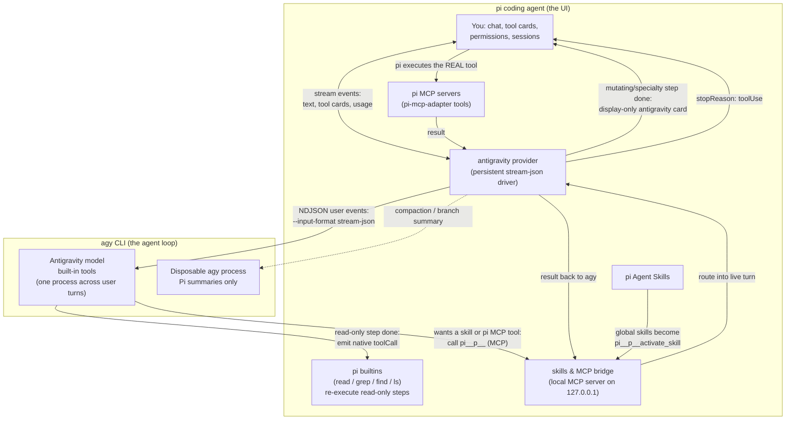

# @tian.zuo/pi-antigravity

Release notes: [changelog](https://github.com/TianZuo555/pi-extensions/blob/main/packages/pi-antigravity/CHANGELOG.md) · [GitHub releases](https://github.com/TianZuo555/pi-extensions/releases)

Use **Google Antigravity** (`agy`) models inside the [pi coding agent](https://pi.dev). pi stays your UI — chat, model picker, tool cards, sessions — while the selected Antigravity model runs underneath through the `agy` CLI.

## Highlights

- **Antigravity models in pi's model picker** — `antigravity/gemini-3.7-flash` and friends, with automatic model discovery and effort-correct launches.
- **Persistent stream driver** — ordinary user turns reuse one healthy `agy` process; conversation, model, workspace, agent, mode, and bridge changes recycle it safely.
- **Actionable diagnostics** — `/agy doctor` explains executable selection, checks every candidate and the minimum version, and reports models, driver spawn/recycle counters, bridge revision, conversation database, and display metadata without spending model tokens.
- **Native rendering, not mimicry** — agy's read-only tools (`view_file`, `grep_search`, `find_by_name`, `list_dir`) are re-executed as real pi builtins (`read` / `grep` / `find` / `ls`), so their cards use pi's own renderers and show live, accurate output. Everything else renders through one display-only `antigravity` wrapper.
- **Skills & MCP bridge** — your global pi Agent Skills are one `pi__p<pid>__activate_skill` tool (pass `{ name }` from the tool's enum), and pi's MCP servers (via the `pi-mcp-adapter` tools) are reachable from agy with pi's permissions, hooks, and rendering. Per-session tool names keep concurrent pi sessions fully isolated.
- **Background-task manager** — long-running agy commands are tracked in a dashboard and stoppable with one keystroke (`/agy-tasks`).
- **Artifact browser** — direct conversation files, generated media, and uploads are listed via `/agy-artifacts`; markdown plans/reports have a bounded read-only preview with checklist progress.
- **Model quotas** — `/agy-usage` ports agy's `/usage` into the same Refresh/Close menu as `/usage`: weekly and 5-hour remaining bars per model group, refreshed without spending tokens.

## How it works



**Tool rendering** splits into two paths:

- **Native re-execution:** when agy finishes a read-only step (`view_file`, `list_dir`, `grep_search`, `find_by_name`), the provider emits a toolCall under the real pi builtin name (`read`, `ls`, `grep`, `find`). pi executes its own tool and renders the card with its native renderer — you see live, accurate output (syntax-highlighted reads, match counts), not agy's summary text. Re-running these is safe: they are read-only and unpermissioned. If the builtin is not active in the session, the step falls back to the display card.
- **Display-only replay:** commands, edits, writes, and agy-specialty tools (web, subagents, image generation, MCP on other servers) must never re-execute — side effects, permission prompts for already-run commands. They end the turn as a tool call for the `antigravity` wrapper tool, whose "execution" just returns the output agy already recorded, rendered as a native-style card.

## Why the `antigravity` tool exists

You will see one registered tool named `antigravity` in `/tools`. It never does work, and no model should ever call it — it has an empty description and no prompt entries on purpose, so it costs nothing in the system prompt. It is only *active* (present in the model's tool payload) while an antigravity model is selected; switching to any other provider's model removes it automatically, and switching back re-adds it. It exists because pi's architecture only understands tool activity through registered tools:

- **Cards:** pi renders a tool card only for a `toolCall` that targets a registered tool.
- **Streaming:** ending an assistant message with a `toolUse` stop reason is the only way to hand control back to pi mid-turn (so the card renders) and then resume the still-running agy process on pi's next provider call. That loop is what chunks one long agy turn into many live cards.
- **Transcript:** proper `toolCall` / `toolResult` pairs (agy tool name, recorded output, error, duration) land in the session JSONL instead of prose in the chat.

Its `execute()` just replays output agy already produced: the provider records each completed step under the synthetic toolCall id, and execution returns the stored result. Commands, edits, writes, and agy-specific tools (web, subagents, image generation) must never re-execute — side effects would duplicate and permission prompts would fire for commands agy already ran — which is exactly why this display-only path sits next to native re-execution for read-only tools.

## Install

```bash
pi install npm:@tian.zuo/pi-antigravity
pi --model antigravity/gemini-3.7-flash
```

Try from a checkout: `pi -e ./packages/pi-antigravity --model antigravity/gemini-3.7-flash`

Requires the `agy` CLI installed and logged in (**v1.1.22+**). `AGY_BINARY` is a strict override. Without it, the extension checks both `agy` on `PATH` and the existing VS Code-managed `~/.gemini/bin/agy`, then selects the newest compatible stable version (or highest prerelease if no stable build exists); a `dev`/`HEAD` build is used only when no compatible versioned candidate exists. Successful checks are cached but automatically invalidated when a candidate path or file signature changes. The extension never downloads or updates executables.

## Features

### Skills & MCP bridge

When an Antigravity model is selected, the extension runs a small local MCP server and registers it with agy as `pi-bridge-<pid>`; switching to any other model (or closing pi) deregisters it and evicts its manifest cache, so non-Antigravity sessions never touch agy. Two kinds of pi surface are bridged:

- **Skills** — one `pi__p<pid>__activate_skill` tool whose JSON-schema enum is the catalog and whose description carries each skill's one-liner, so agy can tell when a skill applies. Calling it with `{ "name": "grilling" }` returns that skill's full `SKILL.md` plus bundled resource paths. The catalog is not appended to the user prompt: agy sees it in tools/list on every spawn, including after pi compaction.
- **MCP** — tools pi got from `pi-mcp-adapter` (the `mcp`/`mcpScript` gateways and per-server direct tools) are exposed with the same prefix.

agy's MCP registry is **global** while bridge servers are per-pi-session, so concurrent sessions' tools all appear in every agy turn's tools/list. The per-session prefix (`pi__p<pid>__`) makes tool→server routing unambiguous: a tool name maps to exactly one session's bridge, so a call can only ever execute in the session that advertised it — never silently in another. Stale registrations and manifest-cache leftovers from crashed sessions are pruned whenever a session registers its bridge. Calls still fail safe: no active turn, unknown tool, or a 480-second timeout returns an error to agy instead of hanging.

An MCP call flows like this:

1. agy calls `pi__p<pid>__<name>` — the bridge routes the call into its live turn.
2. pi ends the assistant message with a tool call for the **real** pi tool — it renders as a normal card and goes through pi's normal permissions and hooks.
3. pi executes it, and the result is handed back to the still-running agy turn.

Nothing else of pi's surface is bridged: builtins (`read`, `bash`, …) and pi's own machinery (`ask_user`, `todo`, `web_search`, …) stay hidden — agy has native equivalents, and invoking pi-session machinery from inside an agy turn would mutate the wrong session. Calls fail safe: no active turn, unknown tool, or a 480-second timeout returns an error to agy instead of hanging.

### Skill passing

Your pi skills work inside agy turns:

- **Workspace skills** (`.agents/skills/` in the project) need nothing — agy discovers and activates them natively.
- **Global skills** (`~/.pi/agent/skills/`, `~/.agents/skills/`) are bridged as `pi__p<pid>__activate_skill`. If the bridge is off (`PI_ANTIGRAVITY_PI_TOOL_BRIDGE=0`) or fails to register with agy, a path catalog is appended directly to the prompt (on a fresh conversation or as a fallback on turns where the bridge is unregistered), so headless agy can read `SKILL.md` directly without losing skill visibility.
- Skills respect pi's own config: `--no-skills`, `pi config` toggles, `/reload`. Skills marked `disable-model-invocation` are skipped.

### Background tasks (`/agy-tasks`)

Long-running commands (dev servers, watchers) become agy background tasks. A hint appears above the editor as soon as the task is detected, without waiting for the agy turn or command to finish:

```text
■ 1 agy background task • /agy-tasks to view
```

The dashboard lists newest tasks first with pid and status: `enter` opens a live, scrollable log view, `x` stops it (whole process group), `r` forces a rescan, esc closes. Task state and open logs refresh automatically. Closing pi automatically stops tasks whose processes are directly tied to their logs; heuristic orphan matches remain available for an explicit stop, avoiding accidental termination of unrelated processes. Non-interactive: `/agy-tasks stop <task-id>|all`.

### Artifacts (`/agy-artifacts`)

Images and files agy creates land in a per-conversation artifact store. A hint appears when new ones exist:

```text
◆ 1 agy artifact • /agy-artifacts to view
```

The dashboard shows name, type, size, and origin (`conversation`, `generated`, or `uploaded`). Direct files under the conversation root are included; `.system_generated`, `scratch`, metadata sidecars, directories, and symlinks are excluded. On markdown, press enter/`v` for a bounded (256 KiB), fatal-UTF-8, read-only preview with exact checklist counts when the complete file was read; esc returns to the list. Press `o` to open a file with the system default app. Non-interactive: `/agy-artifacts open <name>`.

### Model quotas (`/agy-usage`)

agy's interactive `/usage` (alias `/quota`) is a TUI-only slash command — there is no `agy usage` subcommand. `/agy-usage` expands the same slash command in print mode (`agy --print /usage --output-format json`), which returns structured quota groups and reports zero tokens.

The menu matches `/usage`: per-group 5-hour and weekly remaining bars with clock-style reset times. Refresh re-queries; Close dismisses. Print/RPC modes print the same numbers as a notification.

```text
Gemini Models
  5h limit:         [████████████████████] 98% left · resets 19:53

  Weekly limit:     [███████████████████░] 97% left · resets 09:10 on 4 Sep

Claude and GPT models
  5h limit:         [████████████████████] 100% left · resets 20:08

  Weekly limit:     [████████████████████] 100% left · resets 15:08 on 4 Sep
```

## Commands

| Command | What it does |
| --- | --- |
| `/agy` | Conversation title/status (id, model, turns, process, native context) |
| `/agy reset` | Drop the agy conversation and driver; next turn starts fresh |
| `/agy models` | Re-discover models and re-register the provider |
| `/agy agents` | List configured custom agy agents without inference |
| `/agy doctor` | Diagnose all binary candidates/selection, models, driver spawn/recycle counters, bridge, and conversation state |
| `/agy-tasks` | Background-task dashboard (`stop <task-id> | all` for scripts) |
| `/agy-artifacts` | Artifact browser (`open <name>` for scripts) |
| `/agy-usage` | Model quotas (weekly and 5-hour remaining per group) |

## Configuration flags

| Flag | Effect |
| --- | --- |
| `PI_ANTIGRAVITY_PI_TOOL_BRIDGE=0` | Turn the bridge off. Skills fall back to a direct path catalog and direct `SKILL.md` reads. |
| `PI_ANTIGRAVITY_DRIVER=0` | Operational rollback: spawn one `agy --print` process per logical turn. |
| `PI_ANTIGRAVITY_AGENT=<name>` | Select a custom agy agent. Empty, control-character-containing, and overlong values are rejected before spawn. |
| `PI_ANTIGRAVITY_MODE=plan\|accept-edits` | Select agy's stable CLI execution mode. Other values fail before spawn. |
| `AGY_BINARY=/path/to/agy` | Strictly use a specific agy binary; no fallback if it fails. |
| `AGY_TURN_TIMEOUT_MS=600000` | Pi-owned overall budget per active agy turn. Persistent mode intentionally does not pass `--print-timeout`. |
| `AGY_STALL_TIMEOUT_MS=120000` | Kill the turn when the stream produces no bytes for this long and retry by resuming the conversation. `0` disables the watchdog. |
| `AGY_TOOL_STALL_TIMEOUT_MS=300000` | Stall budget while a tool step is ACTIVE — a quiet foreground tool is legitimate, so silence inside a tool gets a longer leash. |
| `AGY_STALL_RETRY_BACKOFF_MS=3000` | Pause before each stall retry. Stalls retry at most twice, rendered as a collapsed "agy stream stalled … restarting the turn" thinking line. |

## Good to know

- **Permissions:** `--dangerously-skip-permissions` is always passed. For autonomous agy shell commands, add `{ "permissions": { "allow": ["command(*)"] } }` to `~/.gemini/antigravity-cli/settings.json`. Bridge calls need no extra rules.
- **Artifact review:** headless runs cannot show agy's review panel, so image generation would abort after creating the file. Set `"artifactReviewMode": "always-proceed"` in the same `settings.json` to let artifacts through (applies to interactive agy too).
- **Image generation errors:** `generate_image` can hit Google-side 429 rate limits; agy retries and usually succeeds — failed attempts show on the card with the real reason.
- **Conversation memory:** lives on agy's side and is reused across turns. The native conversation id and cumulative usage baseline are persisted as branch-local Pi state, so reloading or resuming the same Pi session continues the exact compacted agy conversation. Forks receive a new Pi session id and branch/model/project changes cannot rewind agy's mutable history, so those start fresh from Pi's active summary plus a bounded recent-history tail. A missing persisted agy conversation falls back the same way. `/agy reset` writes a durable reset marker and intentionally starts with no restored history.
- **Thinking level** maps to `agy --effort`: low/minimal → `low`, medium → `medium`, high and above → `high`. Discovery retains each model's supported variants; an unsupported request falls back to that model's discovered default (for example Gemini `high`, GPT-OSS `medium`) instead of launching an invalid normalized model id.
- **Context ownership:** agy governs its real context with a ~200k working window and a 185k safety cap, compacting and persisting the native conversation itself. Models advertise a 1M **Pi scheduling window** so Pi does not summarize first at ~168.6k; this value is not a claim about agy's raw capacity. `/agy` reports the latest observed native footprint. agy's terminal counters accumulate over an entire resumed conversation, while the provider reports the latest response step to Pi.
- **Native compaction display:** agy's documented stream-json protocol does not expose the exact compaction-boundary event used by its TUI. The extension conservatively detects a high-context collapse from response-step input plus cache-read usage and appends a durable `agy compacted context · ~178k → ~36k` divider. Ordinary cache/phase variation is filtered by strict minimum-size, reclaimed-token, and ratio thresholds.
- **Pi compaction fallback:** manual `/compact`, overflow recovery, branch summaries, or eventual Pi scheduling run in disposable agy processes and conversations. The active persistent driver therefore contains only real user prompts, not Pi's serialized `<conversation>…</conversation>` summary requests. These fallback summaries report zero usage because agy is subscription-billed.
- **Driver deadlines:** `agy --print-timeout` is deliberately omitted from persistent mode. agy 1.1.22 can remain alive yet stop producing later results after that process-wide budget elapses. Pi arms overall and inactivity watchdogs only while a user event is active and leaves no timer running while the driver is idle.
- **Driver recycling:** selected binary path/version, workspace, model, resolved effort, custom agent, execution mode, and canonical bridge catalog revision form the process fingerprint. Changes recycle between turns and resume the branch-owned conversation; a pending bridged Pi tool call is never interrupted. `/agy doctor` reports total spawns/respawns, submitted and reused turns, recycle count, current-process turns, and per-cause recycle counters, making accidental per-turn churn visible. Leaving Antigravity closes the driver before bridge teardown.
- **Thinking display:** substantive agy reasoning keeps one collapsed `Thought for …` row per logical turn rather than repeating before every tool phase. Tiny token-only planner/tool traces that native agy does not render as a thought row are suppressed.
- **Cost display** uses model-specific public API reference prices for Gemini and Claude (agy is subscription-billed); open or unknown models stay at zero rather than borrowing another model's price. Override per model in `~/.pi/agent/models.json` under `providers.antigravity.modelOverrides`.
- The print interface is text-only; images in context are replaced by an omission note. Model discovery caches live lists for 24h; fallback snapshots (discovery failed or timed out) expire after 5 minutes so live discovery is retried promptly.
- Conversation metadata from `~/.gemini/antigravity-cli/cache/conversation_metadata.json` enriches `/agy` with a title/steps/update time only. It is bounded, tolerant, and never controls restore; the readable conversation `.db` plus agy's runtime response remain authoritative.
- Hub/Connect RPC, `agentapi`, embedded webviews, passive editor context, executable auto-updates, arbitrary global-conversation switching, and inline accept/reject diffs are intentionally unsupported private/unsafe surfaces from the VS Code extension.
- If an older globally installed copy exists, remove it first: `pi remove npm:@tian.zuo/pi-antigravity`.

## Development

```bash
pnpm --filter @tian.zuo/pi-antigravity run check
pnpm --filter @tian.zuo/pi-antigravity test
```

Reference: [Pi-cursor-sdk](https://github.com/fitchmultz/pi-cursor-sdk)
