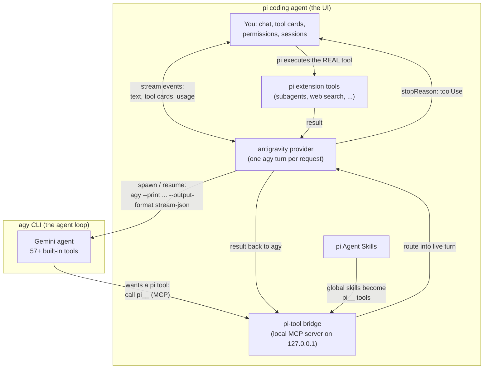

# @tian.zuo/pi-antigravity

Run Google Antigravity (`agy`) models inside the [pi coding agent](https://pi.dev). pi stays the UI — model picker, sessions, tool cards, compaction — while the Gemini agent loop runs underneath through the `agy` CLI.

## How it fits together



## What you get

- **agy models in pi** — pick `antigravity/gemini-3.7-flash` (and friends) from the normal model picker.
- **Native tool cards** — agy's tool calls render like pi's own tools, with live text streaming.
- **Pi-tool bridge** — agy can call pi's extension tools. The tool really runs in pi, with all of pi's permissions, hooks, and rendering.
- **Skill passing** — your pi Agent Skills work inside agy turns.
- **Background-task control** — long-running agy commands (dev servers, watchers) are tracked and killable via `/agy-tasks`.

## Install

```bash
pi install npm:@tian.zuo/pi-antigravity
pi --model antigravity/gemini-3.7-flash
```

Try from a checkout: `pi -e ./packages/pi-antigravity --model antigravity/gemini-3.7-flash`

Requirements: the `agy` CLI installed and logged in (v1.1.17+). Override the binary with `AGY_BINARY`.

## The pi-tool bridge

On session start the extension starts a small local MCP server and registers it with agy as `pi-bridge-<pid>`. Active pi extension tools appear to agy as `pi__<name>` (pi's built-in tools stay hidden — agy has its own).

When agy calls `pi__<name>`:

1. The bridge routes the call into the live agy turn.
2. The provider ends the assistant message with a tool call for the **real** pi tool. It renders as a normal pi tool card and runs through pi's normal permissions and hooks.
3. pi executes it. The next provider request hands the result back to the still-running agy turn.

Calls fail safe: no active turn, unknown tool, or a 480-second timeout returns an error to agy instead of hanging.

### Skills

Your pi skills work in agy turns too:

- **Workspace skills** (`.agents/skills/` in the project) need nothing — agy discovers and activates those on its own.
- **Global skills** (`~/.pi/agent/skills/`, `~/.agents/skills/`) are listed to agy at the start of a conversation, and each one becomes its own tool: `pi__grilling`, `pi__herdr`, … Calling `pi__<skill>` returns the skill's full `SKILL.md` plus its bundled files, so agy can follow it.
- Skills respect pi's own config: `--no-skills`, `pi config` toggles, and `/reload` all apply. Skills marked `disable-model-invocation` are skipped.

### Flags

| Flag | Effect |
| --- | --- |
| `PI_ANTIGRAVITY_PI_TOOL_BRIDGE=0` | Turn the bridge off (no local server, no agy registration). Skills fall back to direct file reads. |
| `PI_ANTIGRAVITY_EXPOSE_BUILTIN_TOOLS=1` | Also expose pi's built-in tools (`read`, `bash`, …) through the bridge. |

The bridge registration is stored in the global `~/.gemini/config/mcp_config.json` (agy has no per-project MCP config) and is removed when the pi session shuts down.

## Commands

- `/agy` — conversation status (id, model, turns)
- `/agy reset` — drop the agy conversation; the next turn starts fresh
- `/agy models` — re-discover models and re-register the provider
- `/agy-tasks` — open the background-task dashboard (`stop <task-id>|all` for scripts)

## Background tasks

When you ask agy to run something long-lived — a dev server, a watcher — agy turns it into a background task: the process keeps running on your machine while the conversation continues. The turn itself ends with a "timeout waiting for response" note (that is agy's protocol limit, not a bug), and a hint appears above the editor:

```text
■ 1 agy background task • /agy-tasks to view
```

`/agy-tasks` shows every task with its pid and status. Press `x` to stop the selected task (SIGTERM to the whole process group, so `npm start` takes Vite down with it), `r` to rescan, `esc` to close.

**Closing pi stops the tasks.** On session shutdown the extension stops any live background tasks of the current conversation, so exiting never leaves stray servers behind. (The agy conversation itself survives on Google's side and can be continued later.)

Tracking works by reading each task's log under `~/.gemini/antigravity-cli/brain/<conversation-id>/…` and checking who holds the log open (`lsof`) — or, after agy has exited, by finding the orphaned process.

## Good to know

- **agy quirks the extension handles for you:** the prompt must come right after `--print`; print mode needs `--add-dir <cwd>` to see your project; `--disable-slash-commands` stops agy's built-in guide skill from hijacking headless turns.
- **Permissions:** `--dangerously-skip-permissions` is always passed. For fully autonomous agy shell commands, add `{ "permissions": { "allow": ["command(*)"] } }` to `~/.gemini/antigravity-cli/settings.json`. MCP calls (the bridge) need no extra rules.
- **Thinking level** maps to `agy --effort`: low → `low`, medium → `medium`, high and above → `high`.
- **Conversation memory** lives on agy's side and is reused across turns; it resets when you switch models, change projects, or run `/agy reset`. (agy pins a conversation to the workspace it was created in — reusing it from another project would write into the old one.) pi-side compaction does not compact it.
- **Images** are not supported by agy's print interface; they are replaced by an omission note.
- **Cost display** uses reference Gemini API prices, since agy is subscription-billed. Override rates per model via `~/.pi/agent/models.json` (`providers.antigravity.modelOverrides`).
- Model discovery runs `agy models` at startup (15s timeout, cached 24h in `~/.pi/antigravity/model-list.json`) with a bundled fallback.
- If an older globally installed copy exists, remove it with `pi remove npm:@tian.zuo/pi-antigravity` — it would conflict with a checkout run via `-e`.

## Development

```bash
pnpm --filter @tian.zuo/pi-antigravity run check
pnpm --filter @tian.zuo/pi-antigravity test
```

Design history and probe results live in [`docs/pi-tool-bridge-plan.md`](docs/pi-tool-bridge-plan.md).
