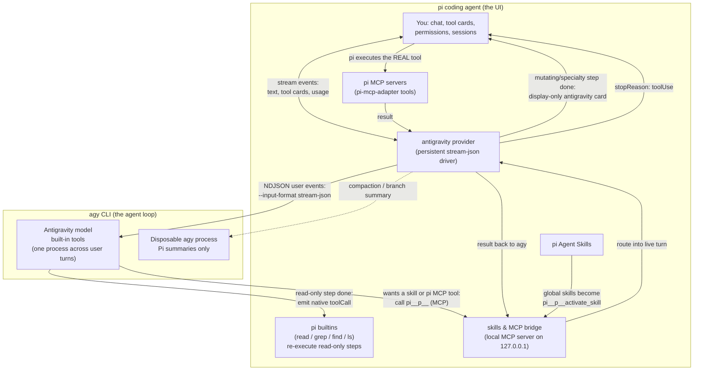

# @tian.zuo/pi-antigravity

Use **Google Antigravity** (`agy`) models inside the [pi coding agent](https://pi.dev). pi stays your UI — chat, model picker, tool cards, sessions — while the selected Antigravity model runs underneath through the `agy` CLI.

## Highlights

- **Persistent stream driver** — ordinary user turns reuse one healthy `agy` process; conversation, model, workspace, agent, mode, and bridge changes recycle it safely.
- **Actionable diagnostics** — `/agy doctor` explains executable selection, checks every candidate and the minimum version, and reports models, driver spawn/recycle counters, bridge revision, conversation database, and display metadata without spending model tokens.
- **Native rendering, not mimicry** — agy's read-only tools (`view_file`, `grep_search`, `find_by_name`, `list_dir`) are re-executed as real pi builtins (`read` / `grep` / `find` / `ls`), so their cards use pi's own renderers and show live, accurate output. Everything else renders through one display-only `antigravity` wrapper.
- **Skills & MCP bridge** — your global pi Agent Skills are one `pi__p<pid>__activate_skill` tool (pass `{ name }` from the tool's enum), and pi's MCP servers (via the `pi-mcp-adapter` tools) are reachable from agy with pi's permissions, hooks, and rendering. Per-session tool names keep concurrent pi sessions fully isolated.
- **Background-task manager** — long-running agy commands are tracked in a dashboard and stoppable with one keystroke (`/agy-tasks`).
- **Artifact browser** — direct conversation files, generated media, and uploads are listed via `/agy-artifacts`; markdown plans/reports have a bounded read-only preview with checklist progress.
- **Model quotas** — `/agy-usage` ports agy's `/usage` into the same Refresh/Close menu as `/usage`: weekly and 5-hour remaining bars per model group, refreshed without spending tokens.

### Background tasks (`/agy-tasks`)

Long-running commands (dev servers, watchers) become agy background tasks. A hint appears above the editor as soon as the task is detected, without waiting for the agy turn or command to finish:

```text
■ 1 agy background task • /agy-tasks to view
```

### Artifacts (`/agy-artifacts`)

Images and files agy creates land in a per-conversation artifact store. A hint appears when new ones exist:

```text
◆ 1 agy artifact • /agy-artifacts to view
```

### Model quotas (`/agy-usage`)

agy's interactive `/usage` (alias `/quota`) is a TUI-only slash command — there is no `agy usage` subcommand. `/agy-usage` expands the same slash command in print mode (`agy --print /usage --output-format json`), which returns structured quota groups and reports zero tokens.

```text
Gemini Models
  5h limit:         [████████████████████] 98% left · resets 19:53

  Weekly limit:     [███████████████████░] 97% left · resets 09:10 on 4 Sep

Claude and GPT models
  5h limit:         [████████████████████] 100% left · resets 20:08

  Weekly limit:     [████████████████████] 100% left · resets 15:08 on 4 Sep
```

## Commands

| Command          | What it does                                                                                                    |
| ---------------- | --------------------------------------------------------------------------------------------------------------- |
| `/agy`           | Conversation title/status (id, model, turns, process, native context)                                           |
| `/agy reset`     | Drop the agy conversation and driver; next turn starts fresh                                                    |
| `/agy models`    | Re-discover models and re-register the provider                                                                 |
| `/agy agents`    | List configured custom agy agents without inference                                                             |
| `/agy doctor`    | Diagnose all binary candidates/selection, models, driver spawn/recycle counters, bridge, and conversation state |
| `/agy-tasks`     | Background-task dashboard (`stop <task-id> \| all` for scripts)                                                 |
| `/agy-artifacts` | Artifact browser (`open <name>` for scripts)                                                                    |
| `/agy-usage`     | Model quotas (weekly and 5-hour remaining per group)                                                            |

## Configuration flags

| Flag                                     | Effect                                                                                                                                       |
| ---------------------------------------- | -------------------------------------------------------------------------------------------------------------------------------------------- |
| `PI_ANTIGRAVITY_PI_TOOL_BRIDGE=0`        | Turn the bridge off. Skills fall back to a direct path catalog and direct `SKILL.md` reads.                                                  |
| `PI_ANTIGRAVITY_DRIVER=0`                | Operational rollback: spawn one `agy --print` process per logical turn.                                                                      |
| `PI_ANTIGRAVITY_AGENT=<name>`            | Select a custom agy agent. Empty, control-character-containing, and overlong values are rejected before spawn.                               |
| `PI_ANTIGRAVITY_MODE=plan\|accept-edits` | Select agy's stable CLI execution mode. Other values fail before spawn.                                                                      |
| `AGY_BINARY=/path/to/agy`                | Strictly use a specific agy binary; no fallback if it fails.                                                                                 |
| `AGY_TURN_TIMEOUT_MS=600000`             | Pi-owned overall budget per active agy turn. Persistent mode intentionally does not pass `--print-timeout`.                                  |
| `AGY_STALL_TIMEOUT_MS=120000`            | Kill the turn when the stream produces no bytes for this long and retry by resuming the conversation. `0` disables the watchdog.             |
| `AGY_TOOL_STALL_TIMEOUT_MS=300000`       | Stall budget while a tool step is ACTIVE — a quiet foreground tool is legitimate, so silence inside a tool gets a longer leash.              |
| `AGY_STALL_RETRY_BACKOFF_MS=3000`        | Pause before each stall retry. Stalls retry at most twice, rendered as a collapsed "agy stream stalled … restarting the turn" thinking line. |

## Development

Reference: [Pi-cursor-sdk](https://github.com/fitchmultz/pi-cursor-sdk)

## How it works



## Release notes

Release notes and logs: [changelog](https://github.com/TianZuo555/pi-extensions/blob/main/packages/pi-antigravity/CHANGELOG.md) · [GitHub releases](https://github.com/TianZuo555/pi-extensions/releases)
