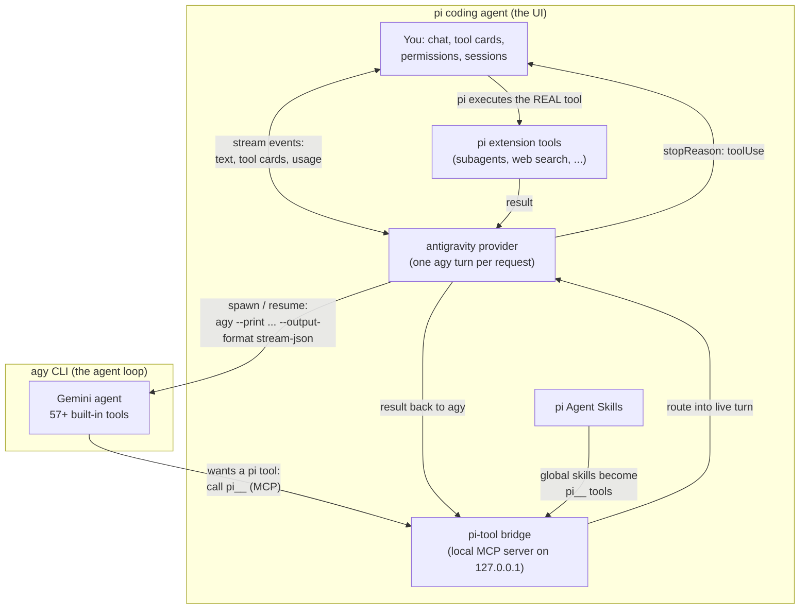

# @tian.zuo/pi-antigravity

Use **Google Antigravity** (`agy`) models inside the [pi coding agent](https://pi.dev). pi stays your UI — chat, model picker, tool cards, sessions — while the Gemini agent loop runs underneath through the `agy` CLI.

## Highlights

- **Antigravity models in pi's model picker** — `antigravity/gemini-3.7-flash` and friends, with automatic model discovery.
- **Native pi experience** — agy's tool calls render as normal pi tool cards; response text streams live.
- **Pi-tool bridge** — agy can call your pi extension tools (subagents, web search, custom tools). The tool really executes in pi, with pi's permissions, hooks, and rendering.
- **Skill passing** — your global pi Agent Skills become callable tools inside agy turns (`pi__grilling`, `pi__herdr`, …).
- **Background-task manager** — long-running agy commands are tracked in a dashboard and stoppable with one keystroke (`/agy-tasks`).
- **Artifact browser** — images and files agy creates are listed and openable via `/agy-artifacts`, with a status-bar hint when new ones appear.

## How it works



## Install

```bash
pi install npm:@tian.zuo/pi-antigravity
pi --model antigravity/gemini-3.7-flash
```

Try from a checkout: `pi -e ./packages/pi-antigravity --model antigravity/gemini-3.7-flash`

Requires the `agy` CLI installed and logged in (v1.1.17+). Override the binary with `AGY_BINARY`.

## Features

### Pi-tool bridge

On session start, the extension runs a small local MCP server and registers it with agy as `pi-bridge-<pid>`. Your active pi tools appear to agy as `pi__<name>`:

1. agy calls `pi__<name>` — the bridge routes the call into its live turn.
2. pi ends the assistant message with a tool call for the **real** pi tool — it renders as a normal card and goes through pi's normal permissions and hooks.
3. pi executes it, and the result is handed back to the still-running agy turn.

Built-in tools (`read`, `bash`, …) stay hidden because agy has native equivalents. Calls fail safe: no active turn, unknown tool, or a 480-second timeout returns an error to agy instead of hanging.

### Skill passing

Your pi skills work inside agy turns:

- **Workspace skills** (`.agents/skills/` in the project) need nothing — agy discovers and activates them natively.
- **Global skills** (`~/.pi/agent/skills/`, `~/.agents/skills/`) each become their own bridge tool, named after the skill. Calling it returns the skill's full `SKILL.md` plus its bundled files.
- Skills respect pi's own config: `--no-skills`, `pi config` toggles, `/reload`. Skills marked `disable-model-invocation` are skipped.

### Background tasks (`/agy-tasks`)

Long-running commands (dev servers, watchers) become agy background tasks. After each turn a hint appears above the editor:

```text
■ 1 agy background task • /agy-tasks to view
```

The dashboard lists every task with pid and status: `x` stops it (whole process group), `r` rescans, esc closes. Closing pi stops all live tasks automatically. Non-interactive: `/agy-tasks stop <task-id>|all`.

### Artifacts (`/agy-artifacts`)

Images and files agy creates land in a per-conversation artifact store. A hint appears when new ones exist:

```text
◆ 1 agy artifact • /agy-artifacts to view
```

The dashboard shows name, type, size, and origin (`generated` vs `uploaded`). Press `o` to open a file with the system default app. Non-interactive: `/agy-artifacts open <name>`.

## Commands

| Command | What it does |
| --- | --- |
| `/agy` | Conversation status (id, model, turns) |
| `/agy reset` | Drop the agy conversation; next turn starts fresh |
| `/agy models` | Re-discover models and re-register the provider |
| `/agy-tasks` | Background-task dashboard (`stop <task-id>|all` for scripts) |
| `/agy-artifacts` | Artifact browser (`open <name>` for scripts) |

## Configuration flags

| Flag | Effect |
| --- | --- |
| `PI_ANTIGRAVITY_PI_TOOL_BRIDGE=0` | Turn the bridge off. Skills fall back to direct file reads. |
| `PI_ANTIGRAVITY_EXPOSE_BUILTIN_TOOLS=1` | Also expose pi's built-in tools through the bridge. |
| `AGY_BINARY=/path/to/agy` | Use a specific agy binary. |

## Good to know

- **Permissions:** `--dangerously-skip-permissions` is always passed. For autonomous agy shell commands, add `{ "permissions": { "allow": ["command(*)"] } }` to `~/.gemini/antigravity-cli/settings.json`. Bridge calls need no extra rules.
- **Artifact review:** headless runs cannot show agy's review panel, so image generation would abort after creating the file. Set `"artifactReviewMode": "always-proceed"` in the same `settings.json` to let artifacts through (applies to interactive agy too).
- **Image generation errors:** `generate_image` can hit Google-side 429 rate limits; agy retries and usually succeeds — failed attempts show on the card with the real reason.
- **Conversation memory:** lives on agy's side and is reused across turns. It resets when you switch models, change projects, or run `/agy reset` — agy pins conversations to their birth workspace, so reusing one from another project would write into the wrong place.
- **Thinking level** maps to `agy --effort`: low → `low`, medium → `medium`, high and above → `high`.
- **Cost display** uses reference Gemini API prices (agy is subscription-billed). Override per model in `~/.pi/agent/models.json` under `providers.antigravity.modelOverrides`.
- The print interface is text-only; images in context are replaced by an omission note. Model discovery caches for 24h with a bundled fallback.
- If an older globally installed copy exists, remove it first: `pi remove npm:@tian.zuo/pi-antigravity`.

## Development

```bash
pnpm --filter @tian.zuo/pi-antigravity run check
pnpm --filter @tian.zuo/pi-antigravity test
```

Design history and probe results: [`docs/pi-tool-bridge-plan.md`](docs/pi-tool-bridge-plan.md).
