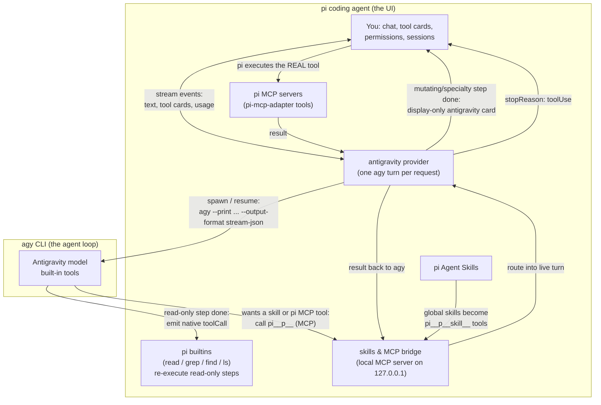

# @tian.zuo/pi-antigravity

Release notes: [changelog](https://github.com/TianZuo555/pi-extensions/blob/main/packages/pi-antigravity/CHANGELOG.md) · [GitHub releases](https://github.com/TianZuo555/pi-extensions/releases)

Use **Google Antigravity** (`agy`) models inside the [pi coding agent](https://pi.dev). pi stays your UI — chat, model picker, tool cards, sessions — while the selected Antigravity model runs underneath through the `agy` CLI.

## Highlights

- **Antigravity models in pi's model picker** — `antigravity/gemini-3.7-flash` and friends, with automatic model discovery.
- **Native rendering, not mimicry** — agy's read-only tools (`view_file`, `grep_search`, `find_by_name`, `list_dir`) are re-executed as real pi builtins (`read` / `grep` / `find` / `ls`), so their cards use pi's own renderers and show live, accurate output. Everything else renders through one display-only `antigravity` wrapper.
- **Skills & MCP bridge** — your global pi Agent Skills become callable tools inside agy turns (`pi__p<pid>__skill__grilling`, …), and pi's MCP servers (via the `pi-mcp-adapter` tools) are reachable from agy with pi's permissions, hooks, and rendering. Per-session tool names keep concurrent pi sessions fully isolated.
- **Background-task manager** — long-running agy commands are tracked in a dashboard and stoppable with one keystroke (`/agy-tasks`).
- **Artifact browser** — images and files agy creates are listed and openable via `/agy-artifacts`, with a status-bar hint when new ones appear.
- **Model quotas** — `/agy-usage` ports agy's `/usage` into the same Refresh/Close menu as `/usage`: weekly and 5-hour remaining bars per model group, refreshed without spending tokens.

## How it works



**Tool rendering** splits into two paths:

- **Native re-execution:** when agy finishes a read-only step (`view_file`, `list_dir`, `grep_search`, `find_by_name`), the provider emits a toolCall under the real pi builtin name (`read`, `ls`, `grep`, `find`). pi executes its own tool and renders the card with its native renderer — you see live, accurate output (syntax-highlighted reads, match counts), not agy's summary text. Re-running these is safe: they are read-only and unpermissioned. If the builtin is not active in the session, the step falls back to the display card.
- **Display-only replay:** commands, edits, writes, and agy-specialty tools (web, subagents, image generation, MCP on other servers) must never re-execute — side effects, permission prompts for already-run commands. They end the turn as a tool call for the `antigravity` wrapper tool, whose "execution" just returns the output agy already recorded, rendered as a native-style card.

## Why the `antigravity` tool exists

You will see one registered tool named `antigravity` in `/tools`. It never does work, and no model should ever call it — it has an empty description and no prompt entries on purpose, so it costs nothing in the system prompt. It is only *active* (present in the model's tool payload) while an antigravity model is selected; switching to any other provider's model removes it automatically, and switching back re-adds it. It exists because pi's architecture only understands tool activity through registered tools:

- **Cards:** pi renders a tool card only for a `toolCall` that targets a registered tool.
- **Streaming:** ending an assistant message with a `toolUse` stop reason is the only way to hand control back to pi mid-turn (so the card renders) and then resume the still-running agy process on pi's next provider call. That loop is what chunks one long agy turn into many live cards.
- **Transcript:** proper `toolCall` / `toolResult` pairs (agy tool name, recorded output, error, duration) land in the session JSONL instead of prose in the chat.

Its `execute()` just replays output agy already produced: the provider records each completed step under the synthetic toolCall id, and execution returns the stored result. Commands, edits, writes, and agy-specific tools (web, subagents, image generation) must never re-execute — side effects would duplicate and permission prompts would fire for commands agy already ran — which is exactly why this display-only path sits next to native re-execution for read-only tools.

## Install

```bash
pi install npm:@tian.zuo/pi-antigravity
pi --model antigravity/gemini-3.7-flash
```

Try from a checkout: `pi -e ./packages/pi-antigravity --model antigravity/gemini-3.7-flash`

Requires the `agy` CLI installed and logged in (v1.1.17+). Override the binary with `AGY_BINARY`.

## Features

### Skills & MCP bridge

On session start, the extension runs a small local MCP server and registers it with agy as `pi-bridge-<pid>`. Two kinds of pi surface are bridged:

- **Skills** — each global pi skill becomes a `pi__p<pid>__skill__<name>` tool that returns its full `SKILL.md` plus bundled resource paths. The catalog advertises the exact callable name, and sanitized name collisions receive stable suffixes.
- **MCP** — tools pi got from `pi-mcp-adapter` (the `mcp`/`mcpScript` gateways and per-server direct tools) are exposed with the same prefix.

agy's MCP registry is **global** while bridge servers are per-pi-session, so concurrent sessions' tools all appear in every agy turn's tools/list. The per-session prefix (`pi__p<pid>__`) makes tool→server routing unambiguous: a tool name maps to exactly one session's bridge, so a call can only ever execute in the session that advertised it — never silently in another. Stale registrations from crashed sessions are pruned at startup. Calls still fail safe: no active turn, unknown tool, or a 480-second timeout returns an error to agy instead of hanging.

An MCP call flows like this:

1. agy calls `pi__p<pid>__<name>` — the bridge routes the call into its live turn.
2. pi ends the assistant message with a tool call for the **real** pi tool — it renders as a normal card and goes through pi's normal permissions and hooks.
3. pi executes it, and the result is handed back to the still-running agy turn.

Nothing else of pi's surface is bridged: builtins (`read`, `bash`, …) and pi's own machinery (`ask_user`, `todo`, `web_search`, …) stay hidden — agy has native equivalents, and invoking pi-session machinery from inside an agy turn would mutate the wrong session. Calls fail safe: no active turn, unknown tool, or a 480-second timeout returns an error to agy instead of hanging.

### Skill passing

Your pi skills work inside agy turns:

- **Workspace skills** (`.agents/skills/` in the project) need nothing — agy discovers and activates them natively.
- **Global skills** (`~/.pi/agent/skills/`, `~/.agents/skills/`) are bridged as described above.
- Skills respect pi's own config: `--no-skills`, `pi config` toggles, `/reload`. Skills marked `disable-model-invocation` are skipped.

### Background tasks (`/agy-tasks`)

Long-running commands (dev servers, watchers) become agy background tasks. A hint appears above the editor as soon as the task is detected, without waiting for the agy turn or command to finish:

```text
■ 1 agy background task • /agy-tasks to view
```

The dashboard lists newest tasks first with pid and status: `enter` opens a live, scrollable log view, `x` stops it (whole process group), `r` forces a rescan, esc closes. Task state and open logs refresh automatically. Closing pi automatically stops tasks whose processes are directly tied to their logs; heuristic orphan matches remain available for an explicit stop, avoiding accidental termination of unrelated processes. Non-interactive: `/agy-tasks stop <task-id>|all`.

### Artifacts (`/agy-artifacts`)

Images and files agy creates land in a per-conversation artifact store. A hint appears when new ones exist:

```text
◆ 1 agy artifact • /agy-artifacts to view
```

The dashboard shows name, type, size, and origin (`generated` vs `uploaded`). Press `o` to open a file with the system default app. Non-interactive: `/agy-artifacts open <name>`.

### Model quotas (`/agy-usage`)

agy's interactive `/usage` (alias `/quota`) is a TUI-only slash command — there is no `agy usage` subcommand. `/agy-usage` expands the same slash command in print mode (`agy --print /usage --output-format json`), which returns structured quota groups and reports zero tokens.

The menu matches `/usage`: per-group 5-hour and weekly remaining bars with clock-style reset times. Refresh re-queries; Close dismisses. Print/RPC modes print the same numbers as a notification.

```text
Gemini Models
  5h limit:         [████████████████████] 98% left · resets 19:53

  Weekly limit:     [███████████████████░] 97% left · resets 09:10 on 4 Sep

Claude and GPT models
  5h limit:         [████████████████████] 100% left · resets 20:08

  Weekly limit:     [████████████████████] 100% left · resets 15:08 on 4 Sep
```

## Commands

| Command | What it does |
| --- | --- |
| `/agy` | Conversation status (id, model, turns) |
| `/agy reset` | Drop the agy conversation; next turn starts fresh |
| `/agy models` | Re-discover models and re-register the provider |
| `/agy-tasks` | Background-task dashboard (`stop <task-id>|all` for scripts) |
| `/agy-artifacts` | Artifact browser (`open <name>` for scripts) |
| `/agy-usage` | Model quotas (weekly and 5-hour remaining per group) |

## Configuration flags

| Flag | Effect |
| --- | --- |
| `PI_ANTIGRAVITY_PI_TOOL_BRIDGE=0` | Turn the bridge off. Skills fall back to direct file reads. |
| `AGY_BINARY=/path/to/agy` | Use a specific agy binary. |

## Good to know

- **Permissions:** `--dangerously-skip-permissions` is always passed. For autonomous agy shell commands, add `{ "permissions": { "allow": ["command(*)"] } }` to `~/.gemini/antigravity-cli/settings.json`. Bridge calls need no extra rules.
- **Artifact review:** headless runs cannot show agy's review panel, so image generation would abort after creating the file. Set `"artifactReviewMode": "always-proceed"` in the same `settings.json` to let artifacts through (applies to interactive agy too).
- **Image generation errors:** `generate_image` can hit Google-side 429 rate limits; agy retries and usually succeeds — failed attempts show on the card with the real reason.
- **Conversation memory:** lives on agy's side and is reused across turns. Resuming or forking a pi session, selecting another history branch, switching models, or changing projects starts a matching agy conversation and restores the active pi branch into it. `/agy reset` intentionally starts with no restored history.
- **Thinking level** maps to `agy --effort`: low → `low`, medium → `medium`, high and above → `high`.
- **Context window:** agy governs context with a ~200k working window and a 185k hard safety cap (`--agent-max-context`), not the vendors' raw 1M/2M limits. Models are registered with a 185k context window so pi's auto-compaction (window − reserveTokens ≈ 168.6k with defaults) and `/context` percentages track agy's real behavior.
- **Compaction billing:** pi's auto-compaction summary runs as an agy turn, and agy reports the transcript's cached re-reads as usage — which inflates the `[compaction]` card into a fictional bill (agy is subscription-billed). Summarization requests are detected and reported with zero usage, so the card shows no cost. Regular turns keep full token accounting.
- **Cost display** uses model-specific public API reference prices for Gemini and Claude (agy is subscription-billed); open or unknown models stay at zero rather than borrowing another model's price. Override per model in `~/.pi/agent/models.json` under `providers.antigravity.modelOverrides`.
- The print interface is text-only; images in context are replaced by an omission note. Model discovery caches live lists for 24h; fallback snapshots (discovery failed or timed out) expire after 5 minutes so live discovery is retried promptly.
- If an older globally installed copy exists, remove it first: `pi remove npm:@tian.zuo/pi-antigravity`.

## Development

```bash
pnpm --filter @tian.zuo/pi-antigravity run check
pnpm --filter @tian.zuo/pi-antigravity test
```

Reference: [Pi-cursor-sdk](https://github.com/fitchmultz/pi-cursor-sdk)
