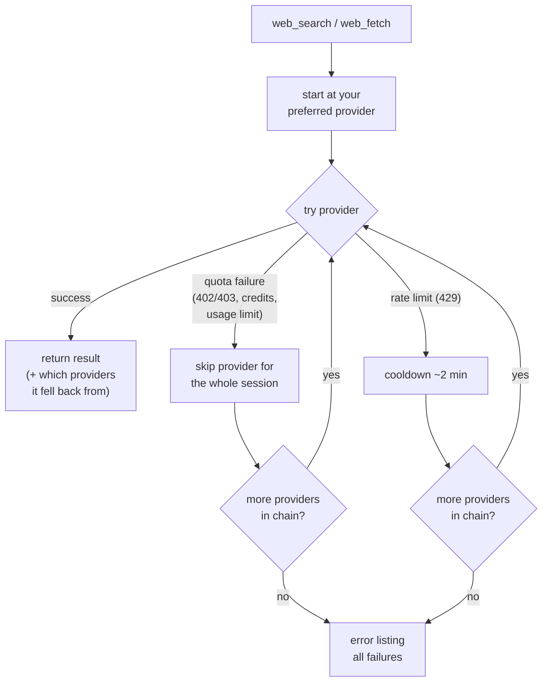

# @tian.zuo/pi-web-search

Web search and web fetch for the [pi coding agent](https://pi.dev). Two tools, four providers, automatic fallback — no single point of failure.

## Install

```bash
pi install npm:@tian.zuo/pi-web-search
```

## Where to put your keys

**Easiest — the `/websearch-auth` command** (inside a pi session). It walks you through each provider, shows what's already configured, and saves straight to the config file:

1. Pick a provider — the list shows each one's state in pi's login-list style: `✓ env: EXA_API_KEY` when an env var is set, `✓ config: fc-1…ab3d` for a stored key, `• unconfigured` otherwise.
2. Paste your key. For **Ollama** it asks for two things: base URL (empty = `localhost:11434`) and an optional API key.
3. Done — submit empty input to remove a stored value; `esc` cancels without saving. Env vars always win over stored keys at request time; you'll get a warning if both are set.

Otherwise you have two manual options. Environment variables win if both are set.

**Option 1 — environment variables** (e.g. in your shell profile or a `.env` loader):

| Variable | Unlocks |
| :--- | :--- |
| `OPENAI_API_KEY` | OpenAI search (also reuses your pi Codex/OpenAI login automatically) |
| `EXA_API_KEY` | Exa search + fetch |
| `FIRECRAWL_API_KEY` | Firecrawl search + fetch |
| `OLLAMA_HOST` / `OLLAMA_API_KEY` | Ollama (local defaults to `http://localhost:11434`) |

**Option 2 — config file** at `~/.config/@tian.zuo/pi-web-search/config.json`:

```json
{
  "searchProvider": "exa",
  "fetchProvider": "firecrawl",
  "openai":  { "apiKey": "sk-...", "model": "gpt-5.6-luna" },
  "exa":     { "apiKey": "..." },
  "firecrawl": { "apiKey": "fc-..." },
  "ollama":  { "baseUrl": "http://localhost:11434", "apiKey": "..." }
}
```

- `searchProvider` / `fetchProvider` set your **preferred** provider; everything else with a valid key stays in the fallback chain.
- No keys at all? Search falls back to Ollama, fetch falls back to **direct fetch** (plain HTTP + main-content extraction, no key needed).

## How the fallback chain works

The chain is built automatically from whichever providers have credentials:

- **search:** `openai → exa → firecrawl → ollama`
- **fetch:** `firecrawl → exa → ollama → direct`

Every call starts at your preferred provider and walks the chain until one succeeds:

- **Quota failures** (402/403, out of credits, usage limits) skip that provider **for the rest of the session** — the next call starts directly at the next healthy provider.
- **Rate limits** (429) only apply a short 2-minute cooldown.
- Successful responses report which providers they fell back from.



## Commands

| Command | Description |
| :--- | :--- |
| `/websearch-auth` | Interactive credential setup (Exa / Firecrawl / Ollama) |

## The tools

### `web_search`

Queries live web sources, returns a concise summary with cited links.

- **OpenAI**: server-side web search via the Responses API with a simple prompt; reuses your active pi login (`openai-codex` / `openai`) or `OPENAI_API_KEY`.
- **Exa / Firecrawl / Ollama**: native API calls.

### `web_fetch`

Reads web pages as clean Markdown.

- **Firecrawl** (`/v1/scrape`), **Exa** (`/contents`), **Ollama** (`/api/web_fetch`): native scrapers.
- **Direct fetch** (the keyless fallback): plain HTTP GET, then main-content extraction with [Defuddle](https://github.com/kepano/defuddle) (the engine behind Obsidian Web Clipper) — navigation, sidebars, and cookie banners are removed before Markdown conversion. If Defuddle finds no usable main content (SPAs, tiny fragments), it falls back to a built-in regex-based converter. Pass `raw: true` to get the untouched response body instead.

## License

MIT
