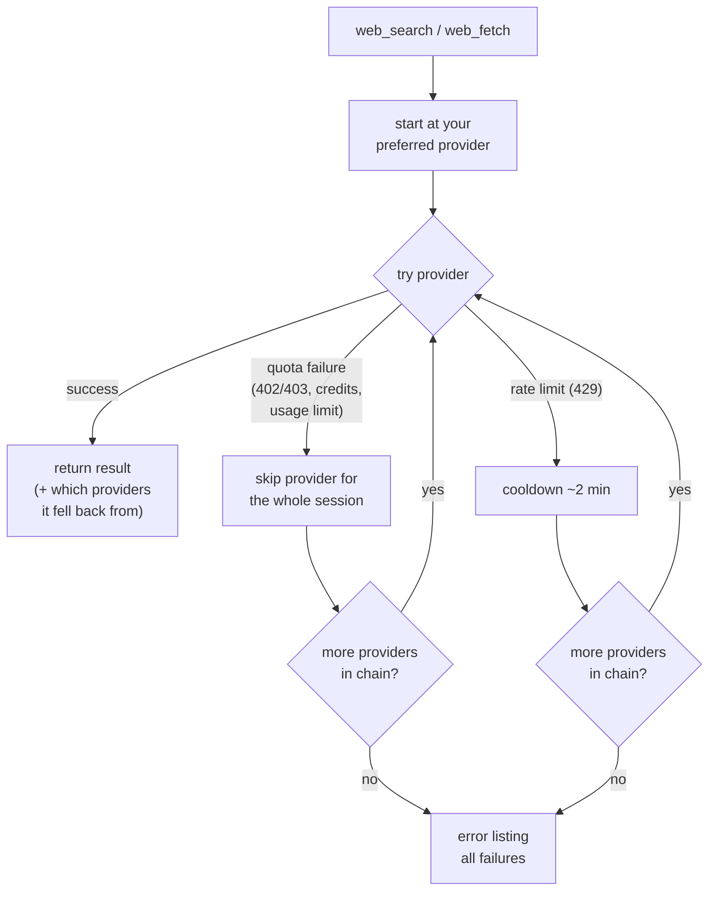

# @tian.zuo/pi-web-search

Web search and web fetch for the [pi coding agent](https://pi.dev). Two tools, five providers, automatic fallback — no single point of failure.

## Install

```bash
pi install npm:@tian.zuo/pi-web-search
```

## Configuration

**Easiest — `/websearch-auth`** inside a pi session: pick a provider, paste your key, done. Keys are stored in pi's own auth file (`~/.pi/agent/auth.json`, same place as `/login` credentials) and never in plain project files. Each option shows its state in pi's login style — green `✓ env: EXA_API_KEY` when an env var is set, green `✓ auth: fc-1…ab3d` for a stored key, `• unconfigured` otherwise. Ollama asks for a base URL (empty = `localhost:11434`, saved to `~/.config/pi-web-search/config.json`) and an optional API key. Empty input removes a stored value; `esc` cancels.

**Manual** — env variables:

| Variable                         | Unlocks                                                                               |
| :------------------------------- | :------------------------------------------------------------------------------------ |
| `OPENAI_API_KEY`                 | OpenAI search — your pi Codex/OpenAI login is used first; this key is only a fallback |
| `EXA_API_KEY`                    | Exa search + fetch                                                                    |
| `FIRECRAWL_API_KEY`              | Firecrawl search + fetch                                                              |
| `TAVILY_API_KEY`                 | Tavily search **and** fetch — one key unlocks both tools (fetch uses Tavily Extract)  |
| `OLLAMA_HOST` / `OLLAMA_API_KEY` | Ollama (default `http://localhost:11434`)                                             |

…or `~/.config/pi-web-search/config.json` for non-secret options (base URLs, preferred provider, fallback order):

```json
{
    "searchProvider": "exa",
    "fetchProvider": "firecrawl",
    "ollama": { "baseUrl": "http://localhost:11434" }
}
```

API keys themselves live in `~/.pi/agent/auth.json` under `websearch-exa` / `websearch-firecrawl` / `websearch-tavily` / `websearch-ollama` (manageable via `/websearch-auth`).

### Configuring the fallback

Nothing to configure by default — every call automatically tries all credentialed providers in the canonical order. Two levels of control:

**1. Pick the starting provider** — `searchProvider` / `fetchProvider`:

- `searchProvider` — `"openai"` | `"exa"` | `"tavily"` | `"firecrawl"` | `"ollama"`
- `fetchProvider` — `"firecrawl"` | `"exa"` | `"tavily"` | `"ollama"` | `"direct"`

**2. Define the whole priority sequence** — `searchOrder` / `fetchOrder` arrays:

```json
{
    "searchOrder": ["tavily", "exa", "firecrawl"],
    "fetchOrder": ["exa", "tavily", "direct"]
}
```

Rules for both levels:

- Listed first = tried first; a requested/configured single provider still jumps the queue ahead of `searchOrder` / `fetchOrder`.
- Entries without valid credentials (and unknown names) are silently skipped.
- Credentialed providers you didn't list still join the end of the chain as backup — you only ever reorder, never lose fallbacks.
- `"direct"` can be listed in `fetchOrder` to pin the keyless fetch as an early step.

With Exa, Tavily, and Firecrawl keys present, the config above gives `web_search` the chain `tavily → openai → exa → firecrawl → ollama` (the `openai` hop appears only when a pi login or `OPENAI_API_KEY` exists) and `web_fetch` the chain `exa → tavily → direct → firecrawl` (`ollama` joins when configured).

No keys at all? Search falls back to Ollama, fetch falls back to **direct fetch** (keyless, no config needed).

### What each provider unlocks

| Provider  |        `web_search`         | `web_fetch` |
| :-------- | :-------------------------: | :---------: |
| OpenAI    |     ✓ (pi login or key)     |      —      |
| Exa       |              ✓              |      ✓      |
| Tavily    | ✓ (with synthesized answer) | ✓ (Extract) |
| Firecrawl |              ✓              |      ✓      |
| Ollama    |              ✓              |      ✓      |
| Direct    |              —              | ✓ (keyless) |

## How the fallback chain works

The chain is built automatically from whichever providers have credentials:

- **search:** `openai → exa → tavily → firecrawl → ollama`
- **fetch:** `firecrawl → exa → tavily → ollama → direct`

Every call starts at your preferred provider and walks the chain until one succeeds:

- **Quota failures** (402/403, out of credits, usage limits) skip that provider **for the rest of the session** — the next call starts directly at the next healthy provider.
- **Rate limits** (429) only apply a short 2-minute cooldown.
- Successful responses report which providers they fell back from.



## Commands

| Command           | Description                                                      |
| :---------------- | :--------------------------------------------------------------- |
| `/websearch-auth` | Interactive credential setup (Exa / Firecrawl / Tavily / Ollama) |

## The tools

### `web_search`

Queries live web sources, returns a concise summary with cited links.

- **OpenAI**: server-side web search via the Responses API with a simple prompt; uses your active pi login (`openai-codex` / `openai`) first, falling back to `OPENAI_API_KEY`.
- **Exa / Tavily / Firecrawl / Ollama**: native API calls. Exa, Tavily, and Firecrawl keys each power **both** search and fetch. Tavily also returns a synthesized answer (shown as `## Summary`).

### `web_fetch`

Reads web pages as clean Markdown.

- **Firecrawl** (`/v2/scrape`, `onlyMainContent` on), **Exa** (`/contents`), **Tavily** (`/extract`, markdown format), **Ollama** (`/api/web_fetch`): native scrapers.
- **Direct fetch** (the keyless fallback): plain HTTP GET, then main-content extraction with [Defuddle](https://github.com/kepano/defuddle) (the engine behind Obsidian Web Clipper) — navigation, sidebars, and cookie banners are removed before Markdown conversion. If Defuddle finds no usable main content (SPAs, tiny fragments), it falls back to a built-in regex-based converter. Pass `raw: true` to get the untouched response body instead.

## License

MIT
