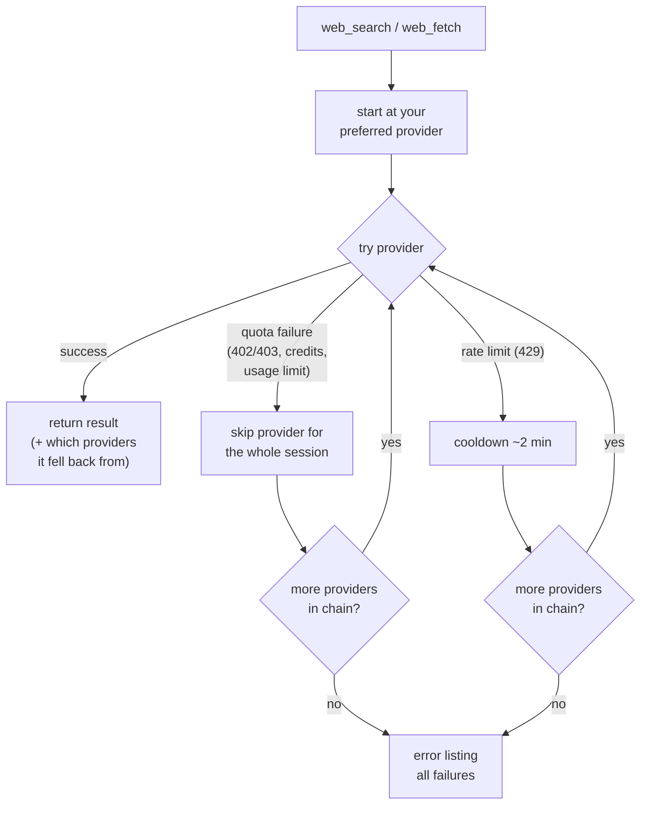

# @tian.zuo/pi-web-search

Web search and web fetch for the [pi coding agent](https://pi.dev). Two tools, six providers plus a built-in keyless fetcher, automatic fallback — no single point of failure. **Works with zero configuration** thanks to Firecrawl's keyless tier (search + fetch, no signup).

> **Token-light by design.** The whole extension adds **196 characters** of model-facing text — two tool descriptions of one sentence each. For comparison, [pi-web-access](https://www.npmjs.com/package/pi-web-access) spends ≈3,200 characters on its `web_search` tool alone (1,853-char description + parameter guidance) — **~16× our entire prompt surface**, across 4 tools vs our 2. All the routing intelligence (fallback orders, keyless ladders, quota handling) lives in extension code, not in the prompt, so the model spends its attention on your code instead of reading tool manuals.

## Install

```bash
pi install npm:@tian.zuo/pi-web-search
```

## Configuration

**Easiest — `/websearch-auth`** inside a pi session: pick a provider, paste your key, done. Keys are stored in pi's own auth file (`~/.pi/agent/auth.json`, same place as `/login` credentials) and never in plain project files. Each option shows its state in pi's login style — green `✓ env: EXA_API_KEY` when an env var is set, green `✓ auth: fc-1…ab3d` for a stored key, `• unconfigured` otherwise. Ollama asks for a base URL (empty = `localhost:11434`, saved to `~/.config/pi-web-search/config.json`) and an optional API key. Empty input removes a stored value; `esc` cancels.

**Where to get a key** — create an account, then generate an API key:

| Provider    | Sign up / API key |
| :---------- | :-------------------------------------------------------------------------------- |
| Exa         | https://dashboard.exa.ai/api-keys |
| Firecrawl   | https://www.firecrawl.dev/app/api-keys — *optional*: works without a key (keyless, 1,000 free credits/mo) |
| Tavily      | https://app.tavily.com |
| Monid (TinyFish) | https://app.monid.ai/access/api-keys |
| OpenAI      | https://platform.openai.com/api-keys (or just stay logged in with `/login`) |
| Ollama      | https://ollama.com — run locally, no key needed |

**Manual** — env variables:

| Variable                         | Unlocks                                                                               |
| :------------------------------- | :------------------------------------------------------------------------------------ |
| `OPENAI_API_KEY`                 | OpenAI search — your pi Codex/OpenAI login is used first; this key is only a fallback |
| `EXA_API_KEY`                    | Exa search + fetch                                                                    |
| `FIRECRAWL_API_KEY`              | Firecrawl search + fetch — optional: without a key, the keyless tier is used (1,000 free credits/mo; set `FIRECRAWL_KEYLESS=0` to disable) |
| `TAVILY_API_KEY`                 | Tavily search **and** fetch — one key unlocks both tools (fetch uses Tavily Extract)  |
| `MONID_API_KEY`                  | Monid search + fetch — TinyFish endpoints via api.monid.ai, $0/call                   |
| `OLLAMA_HOST` / `OLLAMA_API_KEY` | Ollama (default `http://localhost:11434`)                                             |

…or `~/.config/pi-web-search/config.json` for non-secret options (base URLs, preferred provider, fallback order):

```json
{
    "searchProvider": "exa",
    "fetchProvider": "firecrawl",
    "ollama": { "baseUrl": "http://localhost:11434" }
}
```

API keys themselves live in `~/.pi/agent/auth.json` under `websearch-exa` / `websearch-firecrawl` / `websearch-tavily` / `websearch-monid` / `websearch-ollama` (manageable via `/websearch-auth`).

### Firecrawl keyless tier

Firecrawl works without any API key (their [keyless launch](https://www.firecrawl.dev/blog/firecrawl-keyless-launch)): 1,000 free credits/month, no account. This is what makes the extension zero-config. How the ladder works:

- **Keyless first** — free credits are consumed before anything paid.
- **Your key as overflow** — if a Firecrawl key is configured (env or `/websearch-auth`) and the keyless credits run out, requests automatically switch to your key for the rest of the session.
- **Opt out** — set `FIRECRAWL_KEYLESS=0` (env) or `"firecrawl": { "keyless": false }` in `~/.config/pi-web-search/config.json` to only ever use a key. Note keyless sends fetched URLs to firecrawl.dev; the opt-out is there if you don't want that without an account.

### Configuring the fallback

Nothing to configure by default — every call automatically tries all credentialed providers in the canonical order. Two levels of control:

**1. Pick the starting provider** — `searchProvider` / `fetchProvider`:

- `searchProvider` — `"openai"` | `"exa"` | `"tavily"` | `"firecrawl"` | `"ollama"` | `"monid"`
- `fetchProvider` — `"firecrawl"` | `"exa"` | `"tavily"` | `"ollama"` | `"monid"` | `"direct"`

**2. Define the whole priority sequence** — `searchOrder` / `fetchOrder` arrays:

```json
{
    "searchOrder": ["tavily", "exa", "firecrawl"],
    "fetchOrder": ["exa", "tavily", "direct"]
}
```

Rules for both levels:

- Listed first = tried first; a requested/configured single provider still jumps the queue ahead of `searchOrder` / `fetchOrder`.
- Entries without valid credentials (and unknown names) are silently skipped.
- Credentialed providers you didn't list still join the end of the chain as backup — you only ever reorder, never lose fallbacks.
- `"direct"` can be listed in `fetchOrder` to pin the keyless fetch as an early step.

With Exa, Tavily, and Firecrawl keys present, the config above gives `web_search` the chain `tavily → exa → firecrawl → openai → ollama → monid` (the `openai` hop appears only when a pi login or `OPENAI_API_KEY` exists; `monid` only when `MONID_API_KEY` is set) and `web_fetch` the chain `exa → tavily → direct → firecrawl` (`ollama` joins when configured). Without a key, keyless Firecrawl still occupies Firecrawl's slot — so `searchOrder` entries for `firecrawl` are always honored.

No keys at all? Search and fetch both start at **keyless firecrawl**, then fall back to Ollama (search) and **direct fetch** (fetch).

### What each provider unlocks

| Provider  | Sign up |        `web_search`         | `web_fetch` |
| :-------- | :------------------------- | :-------------------------: | :---------: |
| OpenAI    | [platform.openai.com](https://platform.openai.com/api-keys) |     ✓ (pi login or key)     |      —      |
| Exa       | [dashboard.exa.ai](https://dashboard.exa.ai/api-keys) |              ✓              |      ✓      |
| Tavily    | [app.tavily.com](https://app.tavily.com) | ✓ (with synthesized answer) | ✓ (Extract) |
| Firecrawl | [firecrawl.dev](https://www.firecrawl.dev/app/api-keys) | ✓ (keyless: 1k credits/mo) | ✓ (keyless) |
| Monid     | [app.monid.ai](https://app.monid.ai/access/api-keys) | ✓ (TinyFish, $0/call) | ✓ (batch, $0/call) |
| Ollama    | [ollama.com](https://ollama.com) |              ✓              |      ✓      |
| Direct    | — (built-in)                |              —              | ✓ (keyless) |

## How the fallback chain works

The chain is built automatically from whichever providers have credentials:

- **search:** `firecrawl → openai → exa → tavily → ollama → monid`
- **fetch:** `firecrawl → exa → tavily → ollama → monid → direct`

Keyless Firecrawl (real browser, never cached) is the default first option for both tools. Monid (TinyFish) is intentionally the **last** credentialed fallback, and keyless `direct` remains the absolute final fetch fallback. Since Firecrawl works without a key, the extension is fully functional out of the box; add keys to prefer higher-limit providers.

Every call starts at your preferred provider and walks the chain until one succeeds:

- **Quota failures** (402/403, out of credits, usage limits) skip that provider **for the rest of the session** — the next call starts directly at the next healthy provider.
- **Rate limits** (429) only apply a short 2-minute cooldown.
- Successful responses report which providers they fell back from.



## Commands

| Command           | Description                                                      |
| :---------------- | :--------------------------------------------------------------- |
| `/websearch-auth` | Interactive credential setup (Exa / Firecrawl / Tavily / Monid / Ollama) |
| `/websearch-usage` | Show this session's per-provider usage (calls, failures, avg latency), providers on cooldown/blocked, and your Monid wallet balance with recent run costs |

## The tools

### `web_search`

Queries live web sources and returns ranked results with links and snippets. OpenAI and Tavily additionally return a synthesized summary (shown as `## Summary`).

- **Firecrawl** (default): live SERP results, keyed or keyless — see the keyless tier above.
- **OpenAI**: server-side web search via the Responses API with a simple prompt; uses your active pi login (`openai-codex` / `openai`) first, falling back to `OPENAI_API_KEY`.
- **Exa / Tavily / Firecrawl / Monid / Ollama**: native API calls. Exa, Tavily, Firecrawl, and Monid keys each power **both** search and fetch.
- **Monid** (TinyFish via [api.monid.ai](https://monid.ai), $0/call): browser-rendered search — never-cached results with snippets and dates.

### `web_fetch`

Reads web pages as clean Markdown.

- **Firecrawl** (`/v2/scrape`, `onlyMainContent` on): keyed or [keyless](https://www.firecrawl.dev/blog/firecrawl-keyless-launch) — a real browser renders the page, so it succeeds where plain HTTP clients are bot-blocked or starved of JavaScript. **Exa** (`/contents`), **Tavily** (`/extract`, markdown format), **Monid** (TinyFish `/fetch`: real-browser rendering, clean Markdown), **Ollama** (`/api/web_fetch`): native scrapers.
- **Direct fetch** (the keyless fallback): plain HTTP GET, then main-content extraction with [Defuddle](https://github.com/kepano/defuddle) (the engine behind Obsidian Web Clipper) — navigation, sidebars, and cookie banners are removed before Markdown conversion. If Defuddle finds no usable main content (SPAs, tiny fragments), it falls back to a built-in regex-based converter. Pass `raw: true` to get the untouched response body instead.

## License

MIT
